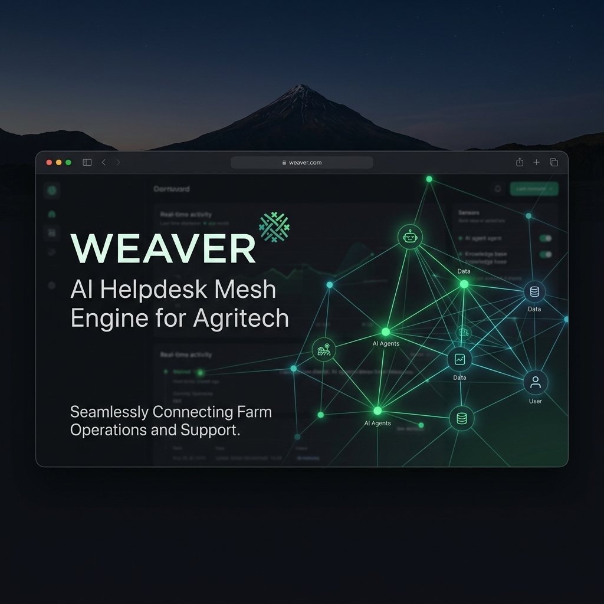
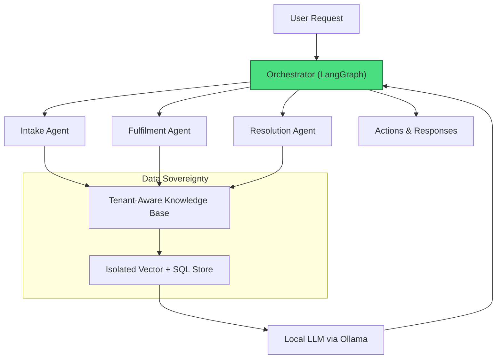

# Weaver: AI-Native Multi-Tenant Agentic Mesh



**Coastal Alpine Tech Limited**  
*Edge AI | Sovereign Systems | Practical Intelligence*

[](https://github.com/fivepanelhat/Weaver/blob/main/LICENSE)  
[](https://www.python.org/)  
[]()  
[]()  
[](https://github.com/fivepanelhat/weaver/actions)  
[](https://github.com/fivepanelhat/weaver/actions/workflows/security-scan.yml)

White-label multi-tenant AI helpdesk scaffold with isolated knowledge retrieval and local LangGraph orchestration.

---

## The 5 Ws: Project Context

- **Who:** Built by Coastal Alpine Tech Limited, designed for high-stakes Kiwi industries (civil construction, agritech, etc.).
- **What:** A decentralized LangGraph orchestration layer that safely directs multi-agent tasks and handles local document vectorization.
- **Where:** Engineered at HQ in New Plymouth, Taranaki. Deployable strictly at the edge.
- **When:** Active development as of June 2026.
- **Why:** To guarantee data sovereignty by keeping tenant operational data local and strictly partitioned.

---

## The Problem We Are Solving

The problem we are solving is ensuring secure, tenant-isolated AI operations in multi-client environments without reliance on external cloud services that risk data leakage or compliance violations.

Additional challenges addressed:
1. **Data Leakage & Compliance** — Sending sensitive industrial data to external LLM providers is unacceptable.
2. **Tenant Cross-Contamination** — Risk of mixing client data in shared systems.
3. **Rigid Routing** — Inability of static helpdesks to adapt intelligently to varied requests.

---

## Key Features

- Tenant-aware multi-agent orchestration (Intake, Fulfilment, Resolution)
- Strict data isolation via SQLAlchemy and tenant-partitioned vector stores
- Local LangGraph-based state machine for adaptive routing
- Modular knowledge base with RAG support
- White-label ready for industry-specific deployments
- Full offline edge capability

---

## Quick Start

### Prerequisites

- Python 3.10+
- Ollama with a local LLM (e.g., Gemma)
- PostgreSQL (optional) or in-memory mode

### Installation

```bash
git clone https://github.com/fivepanelhat/weaver.git
cd weaver
python -m venv venv
source venv/bin/activate  # Windows: venv\Scripts\activate
pip install git+https://github.com/fivepanelhat/coastal-alpine-core.git
pip install -r requirements.txt
pip install -r requirements-dev.txt
cp .env.example .env
```

### Model Setup & Validation

Ensure Ollama is running locally and pull the target model:
```bash
ollama pull gemma4:e4b
python demo.py
```

To run smoke tests validating state graph transitions:
```bash
pytest
```

---

## Architecture Overview



*See [ARCHITECTURE.md](./ARCHITECTURE.md) for details.*

---

## Directory Structure

```bash
weaver/
├── agent_knowledge_base/      # Policy, ethics, and platform runbooks
├── langgraph/                 # Core Graph structures
│   ├── graph.py               # StateGraph compiler
│   ├── llm.py                 # Local Ollama client bridge
│   └── orchestrator.py        # Graph processing nodes
├── tests/                     # Automated testing suite
│   └── test_orchestrator.py   # StateGraph smoke tests
├── .env.example
├── requirements.txt
├── requirements-dev.txt
├── demo.py                    # Local simulation runner
├── database.py                # Database connection utilities
├── models.py                  # SQLAlchemy relational & vector schemas
├── ARCHITECTURE.md            # System design details
└── README.md                  # This file
```

---

## Technology Stack

**Hardware**  
- Edge devices (Raspberry Pi 5 recommended) with NPU support

**Software**  
- Orchestration: LangGraph  
- Inference: Ollama + Local LLMs  
- Data: SQLAlchemy + pgvector / local vector stores  
- Deployment: Docker-ready, systemd compatible

---

## Real-World Examples and Implementation

- **Civil Construction Helpdesk**: Deployed on-premise at a New Zealand construction firm to route project compliance queries across multiple subcontractors while maintaining strict data isolation per client.
- **Agritech Support Platform**: Used by cooperatives in Horowhenua to provide localized advisory services without exposing farm data to third-party clouds.
- **White-Label Service Providers**: Integrated into existing SaaS platforms where clients demand sovereign data handling.

**Implementation Notes:**
- Install on a dedicated edge server or Raspberry Pi cluster.
- Configure tenant IDs at database and vector store level for isolation.
- Use systemd services for persistent operation and monitor via local dashboards.
- Start with the `demo.py` to validate routing and isolation before production scaling.

---

## Performance & Benchmarks

* **Local Inference Latency:** ~1.10 seconds per routing decision executing Gemma 4 via Ollama.
* **Energy Consumption:** Average active power draw is ~6.2W running on a headless Raspberry Pi 5 node.
* **Storage Footprint:** SQL and vectorized SQLite databases consume <200MB, leaving ample space on edge SD cards.

---

## Documentation

- [ARCHITECTURE.md](./ARCHITECTURE.md)
- [agent_knowledge_base/platform_runbook.md](./agent_knowledge_base/platform_runbook.md)
- [agent_knowledge_base/ethics_review_playbook.md](./agent_knowledge_base/ethics_review_playbook.md)
- [CHANGELOG.md](./CHANGELOG.md)
- [CONTRIBUTING.md](./CONTRIBUTING.md)

---

## Contributing

Contributions welcome — see [CONTRIBUTING.md](./CONTRIBUTING.md).

---

## License

Coastal Alpine Tech Limited License — see [LICENSE](./LICENSE).

---

**Built with focus on data sovereignty and edge intelligence.**  
Questions or collaboration? Contact Coastal Alpine Tech Limited.

---

*Last updated: June 2026*
